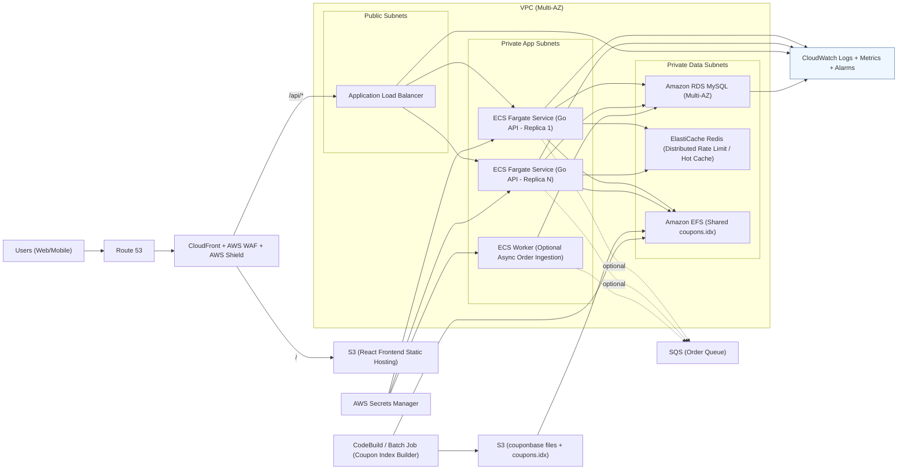

# Food Ordering API (Go)

A production-oriented Go implementation of the backend challenge API defined by the OpenAPI spec.

OpenAPI docs: [openapi.html](https://orderfoodonline.deno.dev/public/openapi.html)  
OpenAPI file: [openapi.yaml](https://orderfoodonline.deno.dev/public/openapi.yaml)

Detailed implementation reference: [CURRENT_IMPLEMENTATION.md](./CURRENT_IMPLEMENTATION.md)

## Overview

This service provides:

- Product read APIs
- Order placement API with input validation
- Global API key authentication middleware
- Per-user rate limiting middleware (token bucket)
- Coupon validation with large-file support
- MySQL-backed order persistence
- Idempotent order creation via `Idempotency-Key`
- Stateless API behavior for horizontal scaling

## Implemented Endpoints

| Method | Path | Description |
|---|---|---|
| `GET` | `/health` | Liveness/health endpoint |
| `GET` | `/product` | Returns all products |
| `GET` | `/product/{productId}` | Returns one product by ID |
| `POST` | `/order` | Validates and places order |
| `GET` | `/openapi.yaml` | Serves OpenAPI spec (non-prod only) |
| `GET` | `/swagger` | Swagger UI redirect (non-prod only) |
| `GET` | `/swagger/index.html` | Swagger UI page (non-prod only) |

## Request/Response Behavior

### Global auth + rate limiting

- Business endpoints require `api_key` header (`/product`, `/product/{productId}`, `/order`).
- Missing `api_key` returns `401 Unauthorized`.
- Invalid `api_key` returns `403 Forbidden`.
- Business endpoints require `X-Device-ID` header.
- Missing `X-Device-ID` returns `400 Bad Request`.
- Client IP is captured from `X-Forwarded-For`, then `X-Real-IP`, then socket remote address.
- Requests are rate-limited using user + device + IP identity.
- User key source:
  - `X-User-ID` (if present)
  - `X-Device-ID`
  - client IP address
- Exceeded limit returns `429 Too Many Requests` with `Retry-After: 1`.
- Every request is logged with method, path, status, duration, bytes, `ip`, `device_id`, and `user_id`.
- Public endpoints:
  - `GET /health` (no auth/device required)
  - Swagger endpoints in non-prod mode (no auth/device required)

### `GET /health`

- Public endpoint for probes.
- Returns `200 OK` with status, environment, uptime, and timestamp.

### Swagger (non-prod only)

- Enabled by default when `APP_ENV` is not `prod`/`production`.
- Disabled by default in production.
- Endpoints:
  - `GET /openapi.yaml`
  - `GET /swagger` (redirects to `/swagger/index.html`)
  - `GET /swagger/index.html`

### `GET /product`

- Returns `200 OK` with full product list.
- Adds cache header: `Cache-Control: public, max-age=30, s-maxage=300, stale-while-revalidate=120`.

### `GET /product/{productId}`

- `400 Bad Request` for invalid non-positive/non-numeric IDs.
- `404 Not Found` when ID does not exist.
- `200 OK` with product JSON when found.
- Adds same cache header as list endpoint.

### `POST /order`

- Returns `400 Bad Request` for malformed JSON, unknown fields, or trailing JSON.
- Returns `422 Unprocessable Entity` for business validation failures.
- Returns `409 Conflict` when idempotency key is reused with a different payload.
- Returns `500 Internal Server Error` for coupon store/DB internal failures.
- Returns `200 OK` with persisted order payload on success.

## Core Business Rules

### Coupon validity

A coupon is valid only when all rules pass:

- Length is between 8 and 10 characters.
- Characters are alphanumeric only.
- Coupon exists in at least 2 coupon source files.

Normalization applied before check:

- Trim spaces.
- Convert to uppercase.

### Order validity

- `items` must be non-empty.
- Every item must have a non-empty `productId`.
- Every item must have `quantity > 0`.
- All `productId` values must exist in the product catalog.

## AWS Infrastructure Diagram



## Coupon Validation at Large Scale

The runtime supports two coupon modes.

### Mode 1: Indexed validation (recommended)

- Build one binary index from huge files.
- Runtime lookup is binary search `O(log N)`.
- Avoids scanning multi-GB files per request.
- Supports hot reload when index file changes.

Build index from large files:

```bash
go run ./cmd/couponindex \
  -out data/coupons.idx \
  /Users/fuzail/Downloads/couponbase1.txt \
  /Users/fuzail/Downloads/couponbase2.txt \
  /Users/fuzail/Downloads/couponbase3.txt
```

Run API with index:

```bash
COUPON_INDEX_FILE=data/coupons.idx go run ./cmd/api
```

### Mode 2: File scanning fallback

- Used only when `COUPON_INDEX_FILE` is not set.
- Supports `.txt` and `.gz` sources.
- Correct behavior but slower for very large files.

## Idempotency for Safe Retries

`POST /order` supports optional `Idempotency-Key`.

- Same key + same normalized request payload returns the original order.
- Same key + different payload returns `409 Conflict`.
- Behavior is safe across replicas because state is persisted in MySQL with a unique constraint.

## Persistence Layer (MySQL)

Order persistence uses transactional writes:

1. Insert order row.
2. Insert all order item rows.
3. Commit transaction.

Schema is auto-created/updated at startup.

### Tables

`orders`

- `id` (`VARCHAR(64)`) primary key
- `coupon_code` (`VARCHAR(32)`) nullable
- `created_at` (`DATETIME(6)`)
- `idempotency_key` (`VARCHAR(128)`) nullable unique
- `request_hash` (`CHAR(64)`) nullable

`order_items`

- `id` (`BIGINT UNSIGNED`) primary key auto-increment
- `order_id` (`VARCHAR(64)`) FK -> `orders.id`
- `product_id` (`VARCHAR(64)`)
- `quantity` (`INT`)
- `position` (`INT`)
- `created_at` (`DATETIME(6)`)

## Configuration

| Variable | Default | Purpose |
|---|---|---|
| `PORT` | `8080` | HTTP listen port |
| `PRODUCTS_FILE` | `data/products.json` | Product source file |
| `APP_ENV` | `development` | Deployment environment (`production` disables Swagger by default) |
| `ENABLE_SWAGGER` | `true` in non-prod, `false` in prod | Explicit Swagger enable/disable override |
| `OPENAPI_FILE` | `data/openapi.yaml` | OpenAPI file path served by Swagger endpoints |
| `API_KEY` | `apitest` | Required `api_key` for all API requests |
| `DEVICE_ID_HEADER` | `X-Device-ID` | Header name used to read device ID from each request |
| `RATE_LIMIT_RPS` | `20` | Per-user sustained request rate |
| `RATE_LIMIT_BURST` | `40` | Per-user burst capacity |
| `RATE_LIMIT_USER_HEADER` | `X-User-ID` | Header used as user identity key |
| `RATE_LIMIT_ENTRY_TTL` | `15m` | Idle TTL for per-user limiter state |
| `RATE_LIMIT_CLEANUP_INTERVAL` | `1m` | Cleanup cadence for stale limiter entries |
| `MYSQL_DSN` | `root:root@tcp(127.0.0.1:3306)/orderfood?parseTime=true&charset=utf8mb4,utf8` | MySQL connection string |
| `MYSQL_MAX_OPEN_CONNS` | `100` | DB pool max open conns |
| `MYSQL_MAX_IDLE_CONNS` | `25` | DB pool max idle conns |
| `MYSQL_CONN_MAX_LIFETIME` | `5m` | DB connection max lifetime |
| `MYSQL_CONN_MAX_IDLE_TIME` | `2m` | DB connection max idle time |
| `COUPON_INDEX_FILE` | empty | Path to prebuilt coupon index |
| `COUPON_INDEX_RELOAD_INTERVAL` | `30s` | Poll interval for index hot reload |
| `COUPON_FILES` | empty | CSV fallback coupon files when no index is set |

## Quick Start

### 1. Prerequisites

- Go `1.25+`
- MySQL `8+`

### 2. Start MySQL (example)

```bash
docker run --name orderfood-mysql \
  -e MYSQL_ROOT_PASSWORD=root \
  -e MYSQL_DATABASE=orderfood \
  -p 3306:3306 \
  -d mysql:8
```

### 3. Run API

```bash
cd /Users/fuzail/Documents/workspace/kart-challenge/backend-challenge
go run ./cmd/api
```

### 4. Run with Docker Compose (separate MySQL + API containers)

```bash
cd /Users/fuzail/Documents/workspace/kart-challenge/backend-challenge
docker-compose up --build -d
```

Check status/logs:

```bash
docker-compose ps
docker-compose logs -f app
```

Stop:

```bash
docker-compose down
```

### 5. Run with Docker (API container only)

Build image:

```bash
docker build -t orderfood-api .
```

Run container:

```bash
docker run --rm -p 8080:8080 \
  -e API_KEY=apitest \
  -e MYSQL_DSN='root:root@tcp(host.docker.internal:3306)/orderfood?parseTime=true&charset=utf8mb4,utf8' \
  orderfood-api
```

### 6. Place an order

```bash
curl -X POST "http://localhost:8080/order" \
  -H "Content-Type: application/json" \
  -H "api_key: apitest" \
  -H "X-Device-ID: device-42" \
  -H "X-User-ID: user-42" \
  -H "Idempotency-Key: order-123" \
  -d '{"couponCode":"HAPPYHRS","items":[{"productId":"1","quantity":2}]}'
```

### 7. Health and Swagger

```bash
curl http://localhost:8080/health
```

In non-production (`APP_ENV=development` by default), open:

- `http://localhost:8080/swagger/index.html`

## Development and Testing

Run all tests:

```bash
go test ./...
```

Run MySQL integration tests:

```bash
MYSQL_TEST_DSN='root:root@tcp(127.0.0.1:3306)/orderfood?parseTime=true&charset=utf8mb4,utf8' go test ./internal/order -run Integration
```

## Operational Notes

- API server has graceful shutdown on `SIGINT`/`SIGTERM`.
- HTTP timeouts are configured for safer production behavior.
- API key auth is enforced before handlers execute.
- `X-Device-ID` is required on each API request and client IP is captured per request.
- Per-user in-memory token bucket rate limiting (user + device + IP) mitigates abuse bursts.
- Request logging includes `ip` and `device_id` on every API call.
- Coupon index reload is automatic when file `modTime` or size changes.
- Product endpoints are cache-header enabled for CDN/proxy usage.

## Scalability Characteristics

### What scales well today

- Stateless API replicas behind load balancer.
- In-memory product lookups.
- Indexed coupon binary search.
- Retry-safe idempotency for order writes.
- Configurable MySQL connection pooling.

### What to add for very high throughput

- Async order ingestion with queue + workers.
- Redis for hot read caching and shared idempotency acceleration.
- MySQL read/write split and partitioning strategy.
- Regional deployment with local replicas and global traffic routing.
- Rate limiting and request shedding under burst load.

## Repository Layout

- `cmd/api`: API executable
- `cmd/couponindex`: coupon index builder executable
- `internal/app`: app wiring + config
- `internal/httpapi`: HTTP handlers + middleware
- `internal/catalog`: product catalog loader
- `internal/coupon`: coupon validators + index/reload logic
- `internal/order`: order storage interfaces + MySQL implementation
- `data`: product and generated index files
- `testdata`: coupon test fixtures

## Notes

- The service follows the challenge OpenAPI contract as implemented in code.
- For exact runtime details, see [CURRENT_IMPLEMENTATION.md](./CURRENT_IMPLEMENTATION.md).
